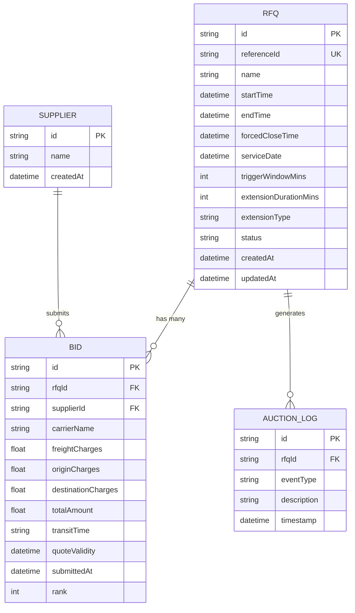

# Database Schema Design

This document outlines the database structure and relationships for the Gocomet RFQ & Auction System.

## 📊 Entity Relationship Diagram

## 📋 Table Definitions

### 1. RFQ (Request For Quotation)
Stores the core auction details and configuration for extensions.

| Column | Type | Description |
| :--- | :--- | :--- |
| `id` | UUID | Primary Key. |
| `referenceId` | String | Unique human-readable identifier. |
| `name` | String | Name of the RFQ. |
| `startTime` | DateTime | When the auction starts. |
| `endTime` | DateTime | Current scheduled closing time (dynamic). |
| `forcedCloseTime` | DateTime | Absolute deadline that cannot be exceeded. |
| `serviceDate` | DateTime | The date the service is required. |
| `triggerWindowMins`| Integer | Minutes before `endTime` where bids trigger extensions. |
| `extensionDurationMins`| Integer | Minutes to add to `endTime` when triggered. |
| `extensionType` | String | Logic for extension (`ANY_BID`, `ANY_RANK`, `L1_RANK`). |
| `status` | String | Current state (`ACTIVE`, `CLOSED`, `FORCE_CLOSED`). |

### 2. Supplier
Stores information about the participating vendors.

| Column | Type | Description |
| :--- | :--- | :--- |
| `id` | UUID | Primary Key. |
| `name` | String | Supplier name. |
| `createdAt` | DateTime | Timestamp when supplier was added. |

### 3. Bid
Stores individual quotes submitted by suppliers for specific RFQs.

| Column | Type | Description |
| :--- | :--- | :--- |
| `id` | UUID | Primary Key. |
| `rfqId` | UUID | Foreign Key referencing `RFQ`. |
| `supplierId` | UUID | Foreign Key referencing `Supplier`. |
| `carrierName` | String | Name of the shipping carrier. |
| `freightCharges` | Float | Base freight cost. |
| `originCharges` | Float | Costs at the origin port. |
| `destinationCharges`| Float | Costs at the destination port. |
| `totalAmount` | Float | Sum of all charges (Freight + Origin + Destination). |
| `transitTime` | String | Estimated time for delivery. |
| `quoteValidity` | DateTime | Expiry date of the quote. |
| `submittedAt` | DateTime | Timestamp of bid submission. |
| `rank` | Integer | Calculated rank based on `totalAmount`. |

### 4. AuctionLog
Audit trail for significant auction events.

| Column | Type | Description |
| :--- | :--- | :--- |
| `id` | UUID | Primary Key. |
| `rfqId` | UUID | Foreign Key referencing `RFQ`. |
| `eventType` | String | Type of event (`BID_SUBMITTED`, `EXTENSION_TRIGGERED`, etc). |
| `description` | Text | Human-readable details of the event. |
| `timestamp` | DateTime | When the event occurred. |
