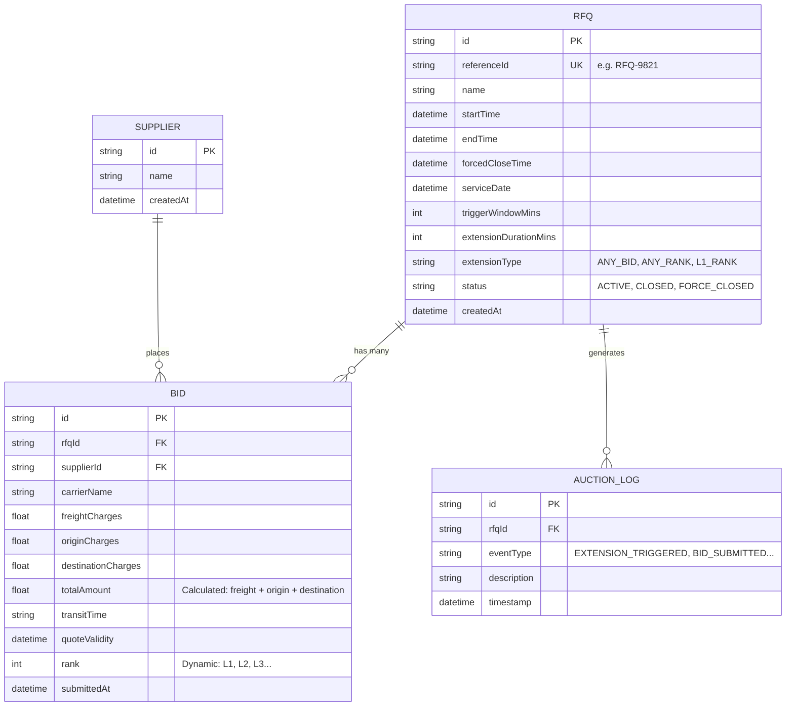

# Gocomet RFQ System - Database Architecture

This document outlines the Entity-Relationship (ER) model for the Gocomet RFQ & Auction System.

## ER Diagram

## Data Dictionary

### RFQ (Request for Quotation)
- **referenceId**: Unique human-readable identifier.
- **status**:
  - `ACTIVE`: Bidding is open.
  - `CLOSED`: Normal end time reached.
  - `FORCE_CLOSED`: The absolute deadline (forcedCloseTime) reached.
- **extensionType**: The rule used to trigger the British Auction extension engine.

### Bid
- **totalAmount**: Sum of Freight, Origin, and Destination charges.
- **rank**: The competitive position (1 = Lowest/L1). Recalculated on every new bid.

### AuctionLog
- Automatically populated by the backend whenever a significant event occurs (Bid submission, Time extension, etc).
