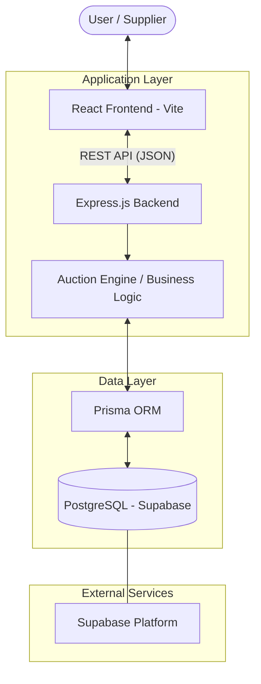

# High-Level Design (HLD) - RFQ & Auction System

This document describes the high-level architecture and design of the Gocomet RFQ & Auction System.

## 🏗️ System Architecture

The application follows a standard **Client-Server Architecture** with a persistent data layer.

## 🧩 Core Components

### 1. Frontend (Client-Side)
*   **Technology**: React.js with Vite.
*   **Responsibilities**:
    *   Providing a responsive UI for creating RFQs and submitting bids.
    *   Visualizing auction status and real-time rank feedback.
    *   Enforcing client-side validations (e.g., date checks).

### 2. Backend (Server-Side)
*   **Technology**: Node.js with Express.js.
*   **Responsibilities**:
    *   **RESTful API**: Exposing endpoints for RFQ management and bidding.
    *   **Auction Engine**: The heart of the system that calculates bid ranks, triggers time extensions, and manages RFQ states (`ACTIVE`, `CLOSED`, `FORCE_CLOSED`).
    *   **Validation**: Enforcing strict business rules (e.g., bid amounts > 0, validity dates).

### 3. Database & ORM
*   **Technology**: PostgreSQL (hosted on Supabase) and Prisma ORM.
*   **Responsibilities**:
    *   Storing structured data for RFQs, Suppliers, Bids, and Logs.
    *   Prisma handles type-safe database queries and migrations.

## 🔄 Core Workflow: Bid Submission

1.  **Request**: A Supplier submits a bid via the Frontend.
2.  **API Call**: Frontend sends a `POST /api/rfqs/:id/bid` request.
3.  **Processing**:
    *   Backend validates the bid data.
    *   Backend calculates the new rank for all suppliers in that RFQ.
    *   **Auction Engine** checks if the bid was placed within the `Trigger Window`.
    *   If conditions are met, the `endTime` of the RFQ is extended.
4.  **Logging**: The event is recorded in the `AuctionLog` table.
5.  **Response**: Updated RFQ status and new rank are returned to the client.

## 🛠️ Technology Stack

| Layer | Technology |
| :--- | :--- |
| **Frontend** | React, Vite, Vanilla CSS |
| **Backend** | Node.js, Express.js |
| **Database** | PostgreSQL (Supabase) |
| **ORM** | Prisma |
| **Hosting** | Vercel (Frontend), Supabase (Database) |
